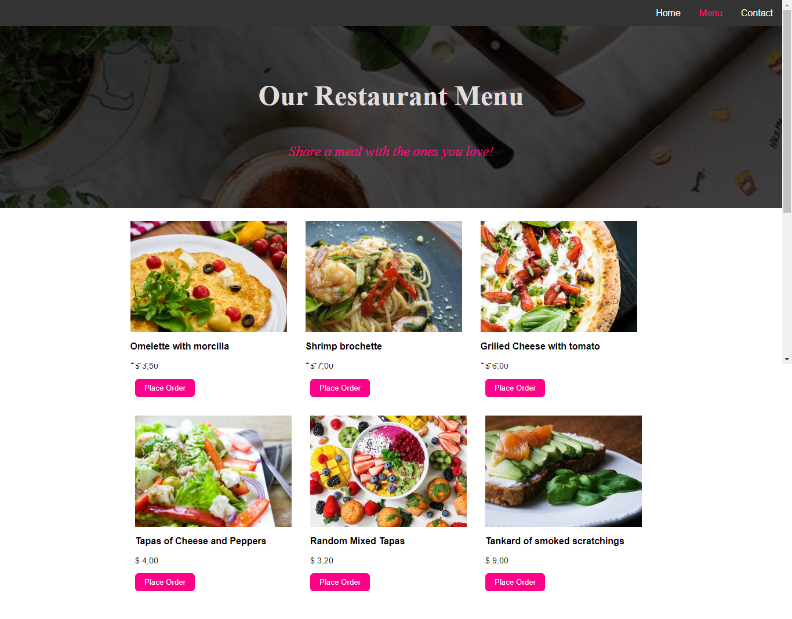

# Restaurant-Page
** The main focus of this project is to build a website (Restaurant Page in this case) that uses webpack and ES6 modules to change the DOM. The pages are static & non-responsive as the main goal was to showcase my skills & gained knowledge working with webpack. Restaurant page has got three different pages, (i.e Home, Menu & Contact). Please take note, the form does not do anything because I haven't added any functionality to it yet.
## Screenshot



## Live Demo
[Live Demo Link](https://arcane-thicket-18116.herokuapp.com/) 

## 🔧 Built with<a name = "with"></a>

HTML, CSS
JavaScript
Webpack
eslint
stylelint

## Configurations
- webpack
- webpack-cli
- eslint
- stylelint
- style-loader
- css-loader


## Prerequisites
node

## Getting Started
To install dependencies Run:
```
npm install
```

The webpack.config.js is set up to run consistently as you make changes on the source code, if you do not like this behavior go ahead and remove the `watch: true` on line 9 in the webpack.config.js file.


## 🔨 Setup <a name = "setup"></a>

- To clone the repo to your local repository. Follow this steps
- <code> git clone https://github.com/ClaytonSiby/Restaurant-Page.git</code>
- <code> cd Restaurant-Page</code>


## Author

👤 **Clayton Siby**
- Github: [@Clayton Siby](https://github.com/ClaytonSiby)
- Twitter: [@ClaytonSiby](https://twitter.com/ClaytonSiby)
- Linkedin: [linkedin](https://www.linkedin.com/in/clayton-siby/)
- claytonsiby@gmail.com

## 🤝 Contributing

Contributions, issues and feature requests are welcome!

Feel free to check the fork this repo and create pull request if you want to make changes.

## 👍 Show your support

Give a ⭐️ if you like this project!

## :thumbsup: Acknowledgements
Let's Build: A Twitter Clone With Ruby on Rails - Parts 1,2 and 3 by WebCrunch